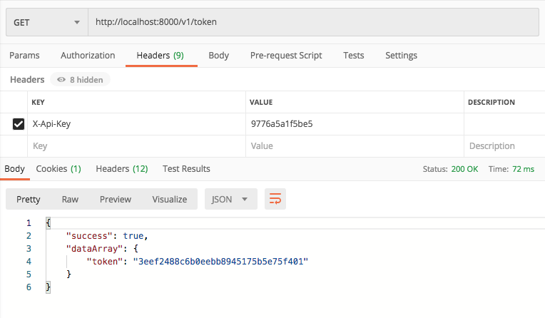
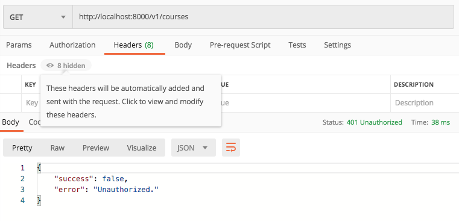
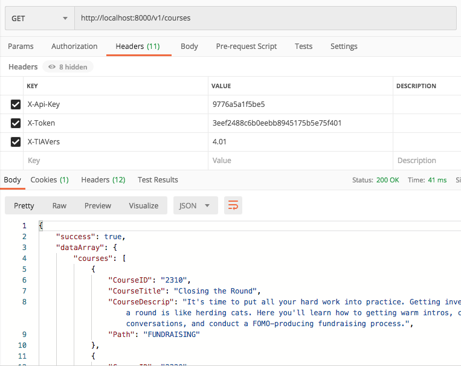

# Yet another Lumen RESTapi skeleton

This is a baseline project demonstrating using the [Lumen PHP framework](https://lumen.laravel.com/docs).

## Why?

There are many such templates out there. I built this one to provide a baseline that has minimal setup and
dependencies. 

No database setup
: It does NOT require a Mysql database to get started so that we can focus on just the aspects 
of configuring REST API endpoints

All JSON
: It focuses on endpoints returning JSON, no HTML views

## RESTful defined

I've seen some so-called RESTful API examples for PHP that are not even close to the definition of RESTful.
For our purposes, some of the properties we require for such are:

- Resources are represented by endpoints with path parameters, e.g. `/course/{id}`
- A resource can be a singleton (e.g.`/course/{id}`) or a collection (e.g. `/courses`)
- Use nouns to represent resources
- Never use CRUD function names in URIs (HTTP request methods should be used to indicate which CRUD function is performed.)
- HTTP request methods should be used to indicate which CRUD function is performed (Never use CRUD function names in URIs)
- Use query component to filter URI collections
- Optional parameters may be provided with query parameters, e.g. `/score?audit=1`

## Dive In

### Endpoints and controllers

Endpoints are defined by routes in `routes/web.php` which reference controllers in `app/Http/Controllers`

#### In web.php
```
$router->get('/example', 'ExampleController@getExample');
```

#### ExampleController.php:
```
class ExampleController extends Controller {
    //
    public function getExample(Request $request) {
        $response = array(
            'example' => $request->header("X-Example"),
        );
        return $this->generateSuccessResponse($response);
    }
}
```

#### Responses

Note that all of our REST endpoints / controllers return JSON, using a common response format:

##### Successful response:

```
{
    "success": true,
    "dataArray": {
        ...
    }
}
```

##### Error response:

```
{
    "success": false,
    "error": "... Human readable error message ..."
}
```

To create a new endpoint, we add a new Class in `app/Http/Controllers` (or add a function to an existing class) and 
add a route in `routes/web.php` for it.

### Authentication

We demonstrate a dummy API Key and token based authentication model implemented in a Lumen route Middleware
component `app/Http/Middleware/Authenticate.php`. In this simple model, the client uses a `/token` endpoint to generate
a token, passing the API Key in a `X-Api-key` header. The `/token` endpoint returns a token if the API Key is valid.
In the sample code, we simply accept any APY key of a minimum length for testing. This is where you would plug in 
an actual authentication mechanism for validating the API Key (see *Next Steps / Integration* section below).

When adding an endpoint, if that endpoint requires authentication, simply add the following to the constructor for 
the controller class:

```
    public function __construct()
    {
        $this->middleware('auth');
    }
```

The controller doesn't need to check for authentication explicitly. The request will be rejected by the middleware if
authentication is missing or invalid.

### Sample Endpoints

#### Simple endpoints:

| Endpoint | Description | Auth. required |
|----------|-------------|----------------|
| / | Reports Lumen version | NO |
| /example | Shows value of X-Example header | NO |

#### V1 endpoints using demo authentication pattern

The pattern uses a /v1/ path to specify version 1 of the API implementation.

We use a sample resource of a *course*, with properties "CourseID", "CourseTitle"  "CourseDescrip", and "Path".

| Endpoint | Description | Auth. required |
|----------|-------------|----------------|
| /v1/token | Generate token from API Key | NO |
| /v1/courses | List all courses | YES |
| /v1/course/{id} | List course {id} | YES |

### Test the V1 API

For testing the REST API, we will use [PostMan](https://www.postman.com/).
Before getting started with the testing, copy the `.env.example` file to `.env` and 
run the following command inside the root of the project folder:

```
php -S localhost:8000 -t public
```

#### Get a token using the API

Now in PostMan, obtain a token with the email and password you used for the ToDo app.

Send a GET request to: http://localhost:8000/v1/token passing the API Key in the X-Api-Key header.



You should receive a Success message along with the API Key.

#### Get all the courses

Try getting all the Course items without sending any credentials, by sending a GET request to: http://localhost:8000/v1/courses



You will get an error of Unauthorized. Next we will add a valid API key and token in the request headers, and then send
the request again.



This time, you will get a list of all the courses.

### Next steps - Integration

To create a finalized REST API from this template, you simply need to
plug in your database or data sources, implement authentication, and add
your endpoints.

Lumen provides Mysql and other database integrations if appropriate for your API
requirements. Refer to the Lumen docs.

For authentication, add code to the TokenController to valiate the API
Key and generate a token in the places noted in the comments in the code.

Add code to the
`app/Http/Middleware/Authenticate.php` middleware to authenticate the
API Key and token in the places noted in the comments in the code.

#### Adding an endpoint

In ``routes/web.php` see the section:

```
$router->group(['prefix' => 'v1/'], function ($router) {
    $router->get('token/','TokenController@getToken');
    $router->get('courses/','CourseController@getAllCourses');
    $router->get('course/{courseId}','CourseController@getOneCourse');

});
```

Add new controllers as necessary to `app/Http/Controllers` following
the pattern of the example controllers provided and add endpoints to the above
section of `web.php` referencing functions in those controllers.

